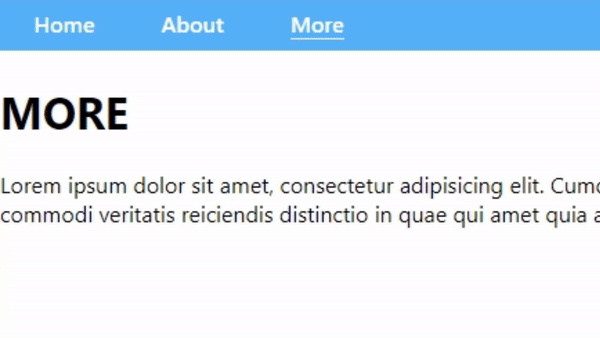

# Navigation Navbar Component



## Getting started

- Install `@rukatya/nav-bar-component-responsive`

  - By using `npm`

  ```
  npm i @rukatya/nav-bar-component-responsive
  ```

- Import the component where you want to use it:

  ```
  import NavBar from '@rukatya/nav-bar-component-responsive'
  ```

- Create a list of links for Navbar:

  ```js
  const links = [
    { to: "/", title: "Home" },
    { to: "/about", title: "About" },
    { to: "/more", title: "More" },
  ];
  ```

- Add it to your React element with links to your project:

  ```js
  function NavBarComponent() {
    return <NavBar links={links} />;
  }
  ```

- You can change the style of the component by adding:

  - userFontFamily (string)
  - userFontWeight (number)
  - userBackgroundColor (string)
  - userColor (string)
  - userFontSize (string)

  ```js
  function NavBarComponent() {
    return (
      <NavBar
        links={links}
        userFontWeight={100}
        userFontSize={"clamp(20px, 1.1vw, 28px)"}
      />
    );
  }
  ```

That's it, you're ready to go!

## Questions?

Feel free to send me a message on [LinkedIn](https://www.linkedin.com/in/katya-rukosuev/).
If you want to report a bug, please [submit an issue](https://github.com/RuKatya/nav-bar-component/issues/new)!

<!--
## About

This is a responsive navbar component created by using:

- React + TypeScript
- React Router Dom
- CSS

[useResponsivity](./src/helper/useWidth.ts) get the page's width and return if it is a mobile/tablet or desktop device. Using this helper, the component shows the navigation bar responsive to the user.
This project includes 3 pages for a comfortable demonstration of component work.

## Running

Installing:

```
npm i @rukatya/nav-bar-component-responsive
```

## FREE FEEL CHANGE THE STYLE OF COMPONENT

The component is [styled](./src/index.css) here.
Feel free to cheng the `:root` variables.

## Hope that will help you! Enjoy!!! -->
